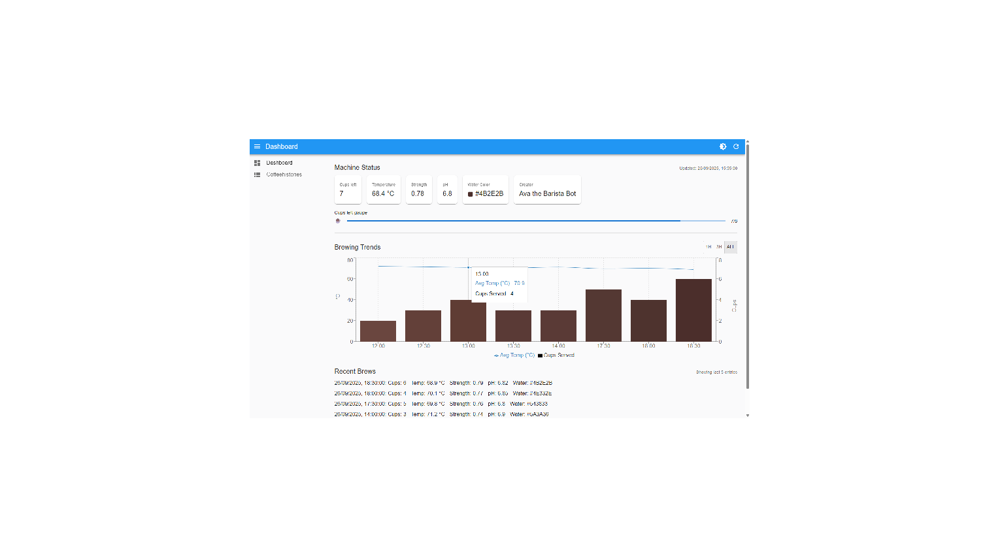
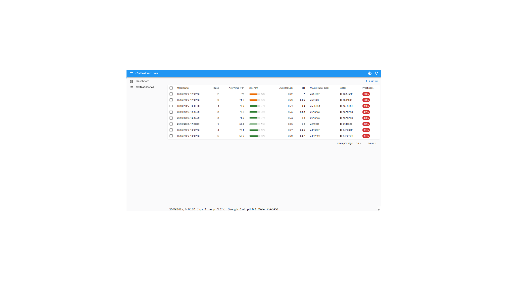

# ☕ Coffee Dashboard - Sample Project

This is a sample project showcasing a frontend dashboard for a coffee machine, built with Next.js, React, and TypeScript. It demonstrates data visualization, API integration, and UI development skills.  

This repository is intended as a **portfolio piece**.

## 🌟 Features

- Dashboard showing current coffee machine status
- Historical trends visualization
- Responsive and reusable components
- Configurable settings for maximum cups
- Modular styling using CSS Modules
- Example usage of charts for data visualization

## 🌟 Live Demo
- [https://coffee-dashboard-yourname.vercel.app](https://coffee-dashboard-yourname.vercel.app)

## 🌟 Screenshots

## 🏗️ Technology Stack

- React.js + Next.js 14
- TypeScript
- CSS3 + CSS Modules
- Recharts for charts
- json-server for mock API
- Docker (optional for local development)

## 🚀 Running Locally (Optional)

If you want to explore the project locally:

**API Server (Mock Data):**
cd server
npm i -g json-server@0.17.4
json-server --watch db.json --routes routes.json --host 0.0.0.0 --port 5001
 `

**Frontend App:**
cd client
npm install
NEXT_PUBLIC_API_URL=http://localhost:5001 npm run dev
 

Open your dashboard: [http://localhost:5000](http://localhost:5000)

> Note: If you are using Docker, the frontend will be available at `http://localhost:5000` and the mock API at `http://localhost:5001`.

## 📂 Project Structure

* `client/` - Frontend application
* `server/` - Mock API server
* `server/db.json` - Mock data
* `server/routes.json` - API routes
* `client/components/` - Reusable React components
* `client/pages/` - Next.js pages

## 📝 Notes

* Designed as a portfolio project to demonstrate frontend development and React skills
* Clean code, modular components, responsive layout
* Optional Docker setup included for local development

## ⚡ Docker Commands (Optional)

**Start services:**
docker-compose up

**Stop services:**
docker-compose down

* Frontend will be available at `http://localhost:5000`
* Mock API server will be available at `http://localhost:5001`
